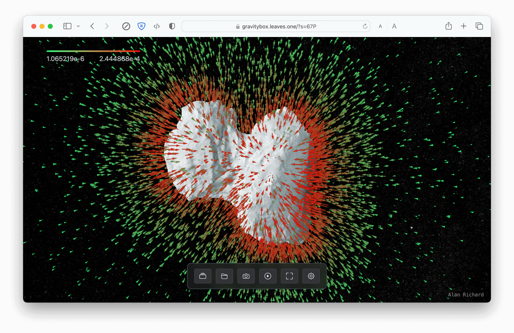
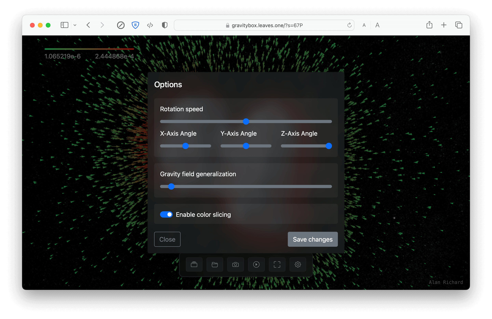

# GravityBox

GravityBox is a front-end project for displaying gravity field and 3D model of asteroids.

Currently samples of 67P and Bennu are available and provided in the `resources` folder. 
They can be found in the library view and can be loaded by clicking on the corresponding entry.

## Screenshots

## Features

- Display gravity field of an asteroid
- Display 3D model of an asteroid
- Generalization of gravity field
- Colorization of gravity field (according to the magnitude)
